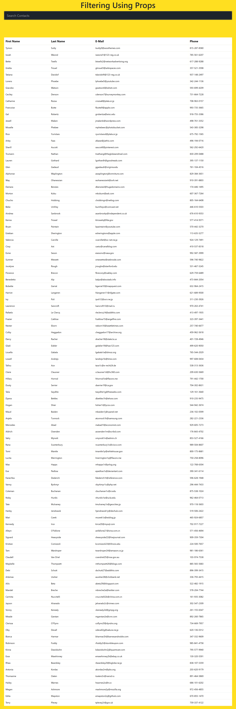

# 📇 FilterBook

**FilterBook** is a simple and efficient contact search/filtering app built with **React** and **Vite**. Users can search through a list of contacts by first name, last name, email, or phone number using real-time filtering — powered by `props`.

---

## 🚀 Features

- 🔎 Live search through a table of contacts
- 🧩 Component-based structure (Form, Table, Page)
- 🔄 Props-driven state handling
- 🧼 Clean UI using TailwindCSS
- ⚡ Fast development setup with Vite

---

## 📁 Project Structure

BASICS/
├── node_modules/
├── public/
├── src/
│ ├── assets/
│ └── component/
│ ├── App.jsx
│ ├── Data.jsx
│ ├── Form.jsx
│ ├── Page.jsx
│ └── Table.jsx
│ ├── index.css
│ ├── main.jsx
├── .gitignore
├── eslint.config.js
├── index.html
├── package.json
├── package-lock.json
├── README.md
└── vite.config.js

---

## 💡 How It Works

### 🔹 `Page.jsx`
- Parent component that controls the state (`search`)
- Passes `search` and `setSearch` via props to `Form` and `Table`

### 🔹 `Form.jsx`
- Renders a controlled `<input>` field
- Calls `props.setSearch()` on every keystroke

### 🔹 `Table.jsx`
- Filters the `Data` array based on `search` prop
- Dynamically renders matching contact rows

### 🔹 `Data.jsx`
- Exports an array of contact objects used for filtering

---

## 🛠️ Getting Started

### 1. Clone the repo

git clone https://github.com/aniketjha437/FilterBook.git
cd FilterBook

## 2. Install dependencies
npm install

### 3. Start the development server
npm run dev

### 4. Open your browser
Navigate to `http://localhost:5173/` to see the app in action.
## 5. Explore the code
Open the project in your favorite code editor to explore the component structure and how props are used for state management.
## 6. Customize
Feel free to modify the `Data.jsx` file to add or change contacts, or customize the UI in `index.css` and component files.
## 7. Contribute
If you find any issues or have suggestions, feel free to open an issue or submit a pull request.

🔍 Sample Contact Format
Each object in Data.jsx looks like this:

{
  id: 1,
  first_name: "Tymon",
  last_name: "Sutty",
  email: "tsutty0@woothemes.com",
  phone: "815-287-8580"
}

🖼️ UI Preview
Add a screenshot in the public folder and link here:

🌱 Future Ideas
Sorting by columns (A-Z, Z-A)

Add/edit/delete contact functionality

Pagination for large datasets

Theme toggle (light/dark mode)

✍️ Author
Aniket Jha
🌐 GitHub - [https://github.com/aniketjha437]